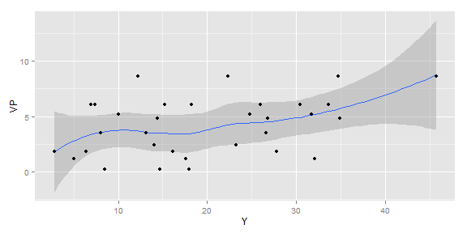

## Description

The Shiny App I wrote uses the `petrol` data set from R and provides yield (Y) percentage(from crude oil) varied by factors mentioned below:

- Specific gravity (SG)

- Vapour pressure in pounds per square inch (VP)

- Volatility of crude (V10)

- Desired volatility of gasoline (EP)


---
## Details

These data were originally used by scientist Prater (1956) to build an estimation equation for the yield of the refining process of crude oil to gasoline.The sniny app covers-

1. **A boxplot of Yeild vs other factors.**

2. **Regression analysis of Yeild vs other factors** to study positive/negative correlations.


---
## Behind the scenes

Getting an overview of the data set-basic exploratory analysis.


```r
library(MASS)
Petrol <- petrol
data(petrol)
library(ggplot2)
qplot(Y,data=petrol,fill=No)
```

```
## stat_bin: binwidth defaulted to range/30. Use 'binwidth = x' to adjust this.
```

 

```r
qplot(Y,VP,data=petrol,geom=c("smooth","point"))
```

```
## geom_smooth: method="auto" and size of largest group is <1000, so using loess. Use 'method = x' to change the smoothing method.
```

 


---
## Conclusion

- Writing the application + these slides took me a lot of time.(My first encounter with R.)


- There is scope for further improvements such as fitting models, multivariate analysis etc in the app, but Keeping in mind the limited time frame and competency of the author in R - hopefully this is excused.


-That being said- slidify is pretty useful for making displayable,
  testable slide decks without much prior knowledge of HTML/Java. The fact that this entire initiative is free is commendable.
  
  
-Any feedback would be welcome.
